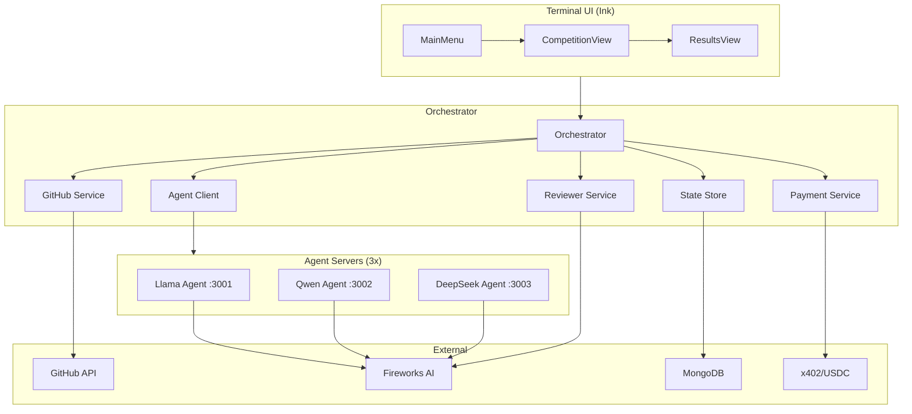
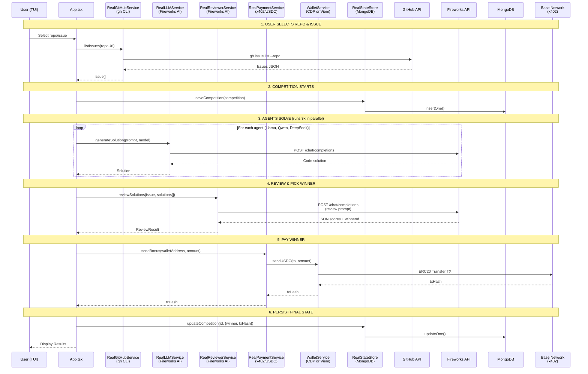

# Source Folder Structure Review

**Date**: 2026-01-10  
**Purpose**: Document the current `src/` directory structure, features, and incomplete implementations.

---

## Overview

The codebase implements **CodeBounty** - a multi-agent coding competition platform with x402 payment integration. AI agents compete to solve GitHub issues, and the winner receives USDC payments via the x402 protocol on Base network.

---

## Folder Structure

### 📁 `src/agents/`

**Purpose**: AI agent server implementations that compete to solve code issues.

| File                 | Description                                                                               |
| -------------------- | ----------------------------------------------------------------------------------------- |
| `agent-server.ts`    | Express HTTP server exposing `/health`, `/solve`, `/info` endpoints for each agent        |
| `coding-agent.ts`    | Core agent logic - takes an issue and generates code solutions via LLM                    |
| `x402-middleware.ts` | HTTP 402 payment middleware (pay-per-call) - requires payment header for protected routes |

**Endpoints**:

- `GET /health` - Health check with agent info
- `POST /solve` - Receives an Issue, returns a Solution
- `GET /info` - Agent configuration

---

### 📁 `src/orchestrator/`

**Purpose**: Central coordinator that runs competitions.

| File              | Description                                                                         |
| ----------------- | ----------------------------------------------------------------------------------- |
| `orchestrator.ts` | Main competition workflow: fetch issue → run agents → review solutions → pay winner |

**Competition Workflow**:

1. Fetch GitHub issue
2. Create competition state
3. Run all agents in parallel
4. Review solutions via reviewer service
5. Pay winner via x402/USDC
6. Persist results to MongoDB

---

### 📁 `src/services/`

**Purpose**: Abstraction layer with mock/real implementations for all external dependencies.

| Subdirectory    | Mock | Real              | Purpose                                      |
| --------------- | ---- | ----------------- | -------------------------------------------- |
| `agent-client/` | ✅   | ⚠️ **INCOMPLETE** | HTTP client to call agent `/solve` endpoints |
| `github/`       | ✅   | ✅                | GitHub integration via `gh` CLI              |
| `llm/`          | ✅   | ✅                | AI code generation via Fireworks API         |
| `payment/`      | ✅   | ✅                | USDC payments via x402 protocol              |
| `reviewer/`     | ✅   | ✅                | LLM-based code review and winner selection   |
| `state/`        | ✅   | ✅                | MongoDB persistence for competitions         |
| `wallet/`       | N/A  | ✅                | CDP and Viem wallet implementations          |

**Service Toggle**: Set `MOCK_*=false` environment variables to use real implementations.

---

### 📁 `src/tui/`

**Purpose**: Terminal User Interface built with Ink (React for CLI).

| File/Folder                      | Description                                               |
| -------------------------------- | --------------------------------------------------------- |
| `App.tsx`                        | Main app with view routing (menu → competition → results) |
| `index.tsx`                      | Entry point, renders App                                  |
| `components/MainMenu.tsx`        | Repo selection and issue browsing                         |
| `components/CompetitionView.tsx` | Live competition progress display                         |
| `components/ResultsView.tsx`     | Winner display and PR creation                            |
| `components/AgentCard.tsx`       | Individual agent status card                              |
| `hooks/useCompetition.ts`        | Competition state management hook                         |

---

### 📁 `src/types/`

**Purpose**: TypeScript type definitions.

| File          | Description                                                     |
| ------------- | --------------------------------------------------------------- |
| `index.ts`    | Domain types: Issue, Solution, Competition, PaymentRecord, etc. |
| `services.ts` | Service interfaces: IGitHubService, IPaymentService, etc.       |

---

### 📁 `src/utils/`

**Purpose**: Shared utilities.

| File        | Description     |
| ----------- | --------------- |
| `logger.ts` | Logging utility |

---

### 📄 Root Files

| File               | Description                                          |
| ------------------ | ---------------------------------------------------- |
| `config.ts`        | Centralized configuration from environment variables |
| `launch-agents.ts` | Script to start all agent servers                    |

---

## Incomplete Implementations

> [!WARNING]
> The following components require additional work before production use.

### 🔴 P1 - Critical

#### 1. `RealAgentClient` is not implemented

**File**: `src/services/agent-client/real.ts`

```typescript
async callAgent(agentUrl: string, task: SolveTask): Promise<Solution> {
  throw new Error('RealAgentClient.callAgent() not implemented');
}
```

**Impact**: Cannot call real agent servers when `MOCK_AGENTS=false`.  
**Required**: Implement HTTP fetch to agent `/solve` endpoints with x402 payment headers.

---

### 🟡 P2 - Important

#### 2. x402 Middleware not integrated into AgentServer

**Files**: `src/agents/agent-server.ts`, `src/agents/x402-middleware.ts`  
**Issue**: The x402 middleware exists but is NOT currently applied to the agent server routes.  
**Required**: Integrate `createX402Middleware()` into AgentServer to enable pay-per-call.

#### 3. CodingAgent lacks code context

**File**: `src/agents/coding-agent.ts`  
**Issue**: The agent only receives issue title/body, not the actual repository code context.  
**Required**: Add repository file fetching to provide relevant code context for better solutions.

#### 4. Wallet address configuration for agents

**File**: `src/config.ts`  
**Issue**: Agent wallet addresses are read from `AGENT_*_WALLET` env vars but may not be set.  
**Required**: Document required env vars or implement wallet auto-generation.

---

### 🟢 P3 - Nice to Have

#### 5. No retry logic for payment failures

**File**: `src/orchestrator/orchestrator.ts`, `src/services/payment/real.ts`  
**Issue**: Payment failures are logged but not retried.  
**Required**: Add exponential backoff retry for transient payment failures.

#### 6. No transaction confirmation tracking

**File**: `src/services/payment/real.ts`  
**Issue**: Payment is sent but confirmation is assumed. No on-chain verification.  
**Required**: Add transaction receipt polling to confirm on-chain settlement.

#### 7. GitHub createIssue ignores labels parameter

**File**: `src/services/github/real.ts:138`

```typescript
async createIssue(repoUrl: string, title: string, body: string, _labels: string[] = [])
```

**Issue**: The `_labels` parameter is received but not used in the `gh issue create` command.

#### 8. Limited error tracking in TUI

**File**: `src/tui/App.tsx`  
**Issue**: Errors are logged to console but not displayed prominently in the TUI.  
**Required**: Add error state display in competition and results views.

---

## Environment Variables

| Variable                   | Description                             | Required                   |
| -------------------------- | --------------------------------------- | -------------------------- |
| `MOCK_GITHUB`              | Use mock GitHub service                 | No (default: true)         |
| `MOCK_LLM`                 | Use mock LLM service                    | No (default: true)         |
| `MOCK_STATE`               | Use mock state store                    | No (default: true)         |
| `MOCK_PAYMENT`             | Use mock payment service                | No (default: true)         |
| `MOCK_AGENTS`              | Use mock agent client                   | No (default: true)         |
| `MOCK_REVIEWER`            | Use mock reviewer service               | No (default: true)         |
| `FIREWORKS_API_KEY`        | Fireworks AI API key                    | Yes (if MOCK_LLM=false)    |
| `MONGODB_URI`              | MongoDB connection string               | Yes (if MOCK_STATE=false)  |
| `CDP_API_KEY_ID`           | CDP API key ID                          | For CDP wallet             |
| `CDP_API_KEY_SECRET`       | CDP API key secret                      | For CDP wallet             |
| `CDP_WALLET_SECRET`        | CDP wallet secret                       | For CDP wallet             |
| `ORCHESTRATOR_PRIVATE_KEY` | Private key for Viem wallet             | For Viem wallet            |
| `ORCHESTRATOR_WALLET_ID`   | CDP wallet ID                           | For CDP wallet             |
| `X402_NETWORK`             | Base network (`base` or `base-sepolia`) | No (default: base-sepolia) |
| `X402_FACILITATOR_URL`     | x402 facilitator URL                    | No                         |
| `USDC_CONTRACT_ADDRESS`    | USDC contract address                   | No (default: testnet)      |
| `AGENT_LLAMA_WALLET`       | Llama agent wallet address              | For payments               |
| `AGENT_QWEN_WALLET`        | Qwen agent wallet address               | For payments               |
| `AGENT_DEEPSEEK_WALLET`    | DeepSeek agent wallet address           | For payments               |

---

## Architecture Diagram



---

## Summary

The codebase is well-architected with clean separation of concerns. The mock/real service pattern allows for easy development and testing. The main gaps are:

1. **`RealAgentClient`** - Critical for running with real agents
2. **x402 middleware integration** - Critical for monetization
3. **Code context for agents** - Important for solution quality
4. **Payment reliability** - Important for production use

---

## Request Flow (All MOCK\_\*=false)

> [!NOTE]
> This diagram shows the real request flow when all mock services are disabled.



> [!IMPORTANT]
> Even with `MOCK_AGENTS=false`, the current TUI **does not call agent servers**. It calls `services.llm` directly. The `RealAgentClient` is unimplemented, so the agent servers (`dev:agents`) are orphaned infrastructure.
